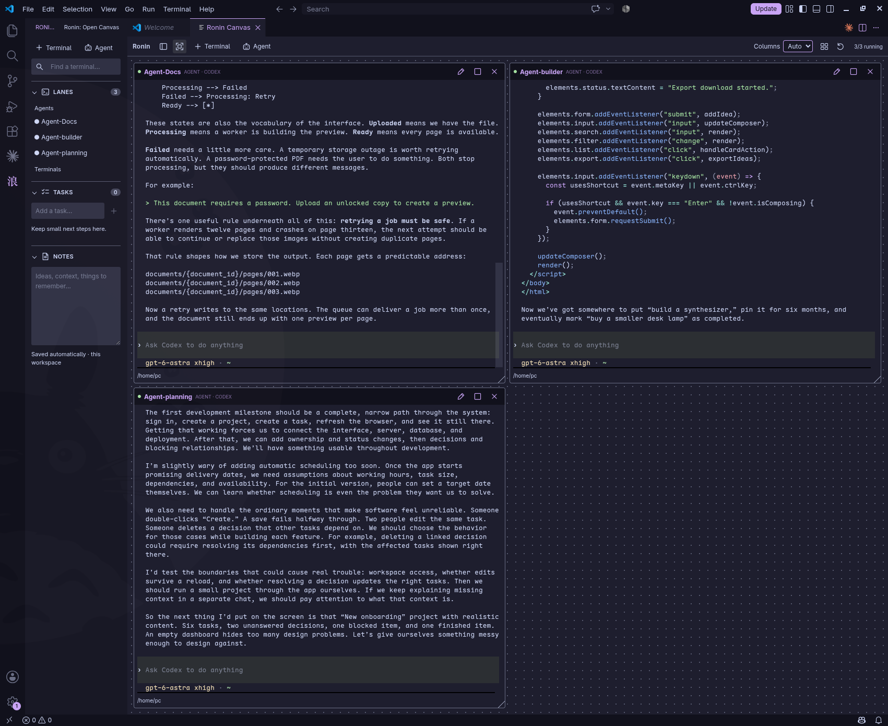

# Ronin Canvas

**Run multiple terminals and AI coding agents side by side inside VS Code.**

Ronin Canvas puts interactive terminals in movable, resizable panels in the main editor area. Keep an agent writing code, another reviewing it, and your development server visible together—without constantly switching terminal tabs.

Every panel is a normal shell. Use your own CLI tools and agent accounts while keeping VS Code's Explorer, editors, and Git tools available.



## What it does

- Move, resize, and arrange terminal panels, or let them automatically fit the available space.
- Save your layout and terminal setup for each workspace.
- Keep terminals running in the background when you reload or close VS Code, then reconnect when you return.
- Save and edit launch commands for individual panels.
- See agents and terminals in a sidebar, alongside workspace notes and tasks.
- Follow your VS Code theme, with visible panel borders and a highlighted active terminal.

**Start** opens a shell. **Run command** launches its saved command. When an agent exits, the shell stays open.

## Get started

Install the `.vsix` using **Extensions: Install from VSIX…**, open a trusted workspace, and run **Ronin: Open Canvas** from the Command Palette. Add a terminal or agent panel and press Start.

**Currently supports Linux x64. macOS and Windows support are not implemented yet.** Agent CLIs must be installed and authenticated separately.

Closing VS Code leaves your programs running. Use **Ronin: Stop Background Terminals** to stop them. Live sessions do not survive a reboot.

## Build

On Linux x64, with Node.js/npm, Python 3, Make, a C++ compiler, and Docker available:

```bash
git clone https://github.com/Tech0001/ronin-vscode.git
cd ronin-vscode
npm ci
npm run package
```

The installable `.vsix` is created in `release/`. Docker is only needed to build the package, not to use it.

## License

[MIT](LICENSE)
